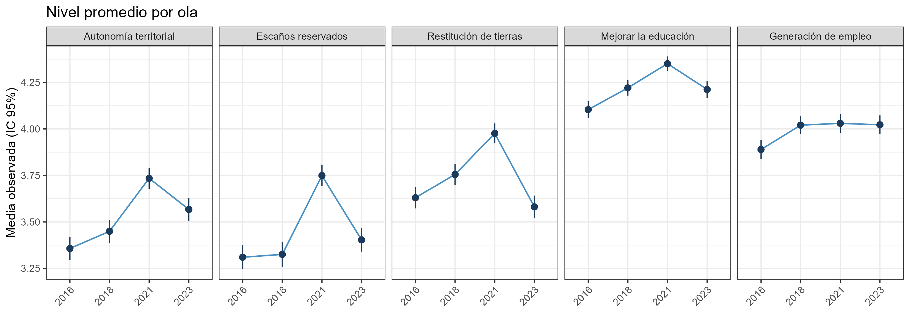

```{r}
#| label: setup
#| include: false

# Gill Sans solo si los archivos están en la carpeta; si no, compila igual
try({
  library(systemfonts)
  library(sysfonts)
  if (file.exists("GIL_____.TTF")) {
    sysfonts::font_add(
      family  = "Gill Sans MT",
      regular = "GIL_____.TTF",
      bold    = "GILB____.TTF",
      italic  = "GILI____.TTF"
    )
    showtext::showtext_auto()
  }
}, silent = TRUE)

options(knitr.kable.NA = "—")

etiquetas <- c(e4_auton_terri = "Autonomía", e4_escanos = "Escaños",
               e4_devolver_terri = "Restitución", e4_mejor_educ = "Educación",
               e4_empleo = "Empleo")
orden <- names(etiquetas)
```

```{=html}
<style>
.reveal .slides { font-size: 0.75em; }
.reveal .slides section h2 { font-size: 1.2em !important; }
.reveal table { font-size: 0.82em; margin-left: auto; margin-right: auto; }
.reveal table th, .reveal table td { padding: 0.25em 0.6em; }
.reveal .callout .callout-body-container { font-size: 1em !important; }
.reveal .callout .callout-title-container { font-size: 1em !important; }
.reveal .eq-flechas { font-size: 1.05em; }
</style>
```

## Contexto: el conflicto indígena llega a la agenda pública

::: columns
::: {.column width="55%"}
::: fragment
- El conflicto entre el Estado y los pueblos indígenas, en particular el mapuche, por territorio y autonomía es una de las tensiones más persistentes de la democracia post-transición [@bauer2016; @pairican2021].
:::

::: fragment
- Chile vivió procesos que pusieron parte de ese conflicto en la **agenda pública**: estallido de 2019, Convención con **escaños reservados** y **Rechazo** de 2022 [@piscopo2021; @somma2021; @disipavlic2024; @turrachico2026].
:::

::: fragment
- Las explicaciones suelen anclarse en actores institucionales y soberanía estatal, pero **rara vez incorporan la importancia que la ciudadanía atribuye a estos temas en el tiempo**.
:::
:::

::: {.column width="45%"}
::: fragment
::: callout-note
## Tres fases del período

**2016 – 2018**\
pre-estallido

$\Downarrow$

**2018 – 2021**\
estallido y proceso constituyente

$\Downarrow$

**2021 – 2023**\
post-Rechazo
:::
:::
:::
:::

------------------------------------------------------------------------

## Brecha, contribución y pregunta de investigación

::: fragment
- Las actitudes hacia grupos minoritarios se han estudiado sobre todo desde **raza e inmigración** [@kustov2021; @achard2025]. Sobre **políticas indígenas** hay poca evidencia, casi siempre transversal [@bergmann2024; @fuentes2025; @bartram2022].
:::

::: fragment
- La sostenibilidad de una política depende de que el tema mantenga **centralidad más allá de su pico mediático**. En las políticas indígenas es crítico: arrastran conflictos históricos y apuntan a poblaciones susceptibles de **reparación histórica** [@kymlicka2003].
:::

::: fragment
- **Contribución:** distinguir cambio persistente de transitorio en la importancia atribuida a políticas indígenas, controlando por error de medición.
:::

::: fragment
- **Pregunta de investigación:**\
  *¿En qué medida las valoraciones de distintas políticas indígenas muestran patrones de cambio persistente o estabilidad durante 2016-2023 en Chile, y cómo varía este patrón según el tipo de política evaluada?*
:::

------------------------------------------------------------------------

## Literatura: SDM, AUM y el rol del QSM

::: fragment
- **SDM** (disposiciones estables): hay una creencia basal y las fluctuaciones entre olas son transitorias o error de medición. **AUM** (actualización activa): las personas revisan sus creencias y ese cambio se propaga a las mediciones siguientes [@kiley2020; @vaisey2021].
:::

::: fragment
- En actitudes raciales y de límite grupal predomina la **estabilidad** una vez controlado el error [@kustov2021]. El cambio persistente es más probable en temas **de alta saliencia** [@kiley2020; @sears1983; @prior2010].
:::

::: fragment
- **Quasi-Simplex (QSM):** separa el *true score* del error de medición con al menos tres olas y entrega la **estabilidad entre olas libre de error** [@wiley1970; @achen1975; @prior2010].
:::

------------------------------------------------------------------------

## El caso chileno: exposición diferenciada de las políticas

::: fragment
- Conflicto extenso y de larga data en la macrozona sur [@montenegro2024; @pairican2021], con una **exposición inédita** en el estallido y la Convención [@piscopo2021; @somma2021].
:::

::: fragment
- **Autonomía, restitución de tierras y escaños reservados** pasaron a la agenda constitucional [@disipavlic2024; @herraz2026; @bauer2018; @turrachico2026]. **Educación y empleo** siguieron como política social secundaria y transversal [@suarezdelucchi2024; @somma2021].
:::

::: fragment
::: callout-tip
## Objetivo

Evaluar **qué modelo explica mejor el cambio** en la importancia atribuida a estas políticas (SDM, AUM o QSM) y **en cuáles se plasma con más claridad**, distinguiendo las de mayor saliencia.
:::
:::

------------------------------------------------------------------------

## Pregunta y datos

::: fragment
- **Pregunta:** *¿En qué medida las valoraciones de distintas políticas indígenas muestran patrones de cambio persistente o estabilidad durante 2016-2023 en Chile, y cómo varía este patrón según el tipo de política evaluada?*
:::

::: fragment
- **ELRI** (CIIR): panel de población indígena y no indígena en tres macrozonas (Norte, Centro, Sur), con sobrerrepresentación indígena y **muestras espejo**.
:::

::: fragment
- **Entrevistados por ola:** 3.613 (2016), 2.879 (2018), 1.847 (2021) y 1.680 (2023). La mayor pérdida ocurre entre 2018 y 2021, por el paso a modalidad telefónica durante el COVID-19.
:::

::: fragment
- **Muestra analítica:** panel balanceado, $N = 1{,}589$. Hay atrición diferencial por etnia, sexo y edad, y no se usan ponderadores longitudinales.
:::

------------------------------------------------------------------------

## Variable dependiente: enunciado e ítems

::: fragment
- *«Existe una serie de políticas que se han discutido para abordar el tema indígena. Según usted, ¿cuán importante es…?»*

  Escala de 5 puntos: 1 = Muy poco, 5 = Mucho.
:::

::: fragment
| Tipo | Ítem (redacción exacta) |
|:--|:--|
| Convención | «Que puedan administrar autónomamente sus territorios» |
| Convención | «Establecer asientos especiales en el congreso» |
| Convención | «Restituirles o devolverles sus tierras» |
| Socioeconómica | «Mejorar su educación» |
| Socioeconómica | «Políticas de generación de empleo» |
:::

------------------------------------------------------------------------

## Estrategia (I): SDM y AUM

::: {.fragment .eq-flechas}
- **SDM**: una disposición individual fija $U_i$ alimenta todas las olas; el resto es transitorio.

$$U_i \;\xrightarrow{\;\;1\;\;}\; \underbrace{y_{i1},\; y_{i2},\; y_{i3},\; y_{i4}}_{y_{it}\,=\,\alpha_t\,+\,U_i\,+\,\varepsilon_{it}}$$
:::

::: {.fragment .eq-flechas}
- **AUM**: el valor de una ola se propaga a la siguiente con persistencia $\rho$.

$$y_{i1} \xrightarrow{\;\;\rho_1\;\;} y_{i2} \xrightarrow{\;\;\rho_2\;\;} y_{i3} \xrightarrow{\;\;\rho_3\;\;} y_{i4} \qquad y_{it}=\alpha_t+\rho_{t-1}\,y_{i,t-1}+\varepsilon_{it}$$
:::

::: fragment
| Modelo | $U_i$ | $\rho$ | Intercepto $\alpha_t$ |
|:--|:-:|:-:|:-:|
| SDM libre | varianza libre | $\rho = 0$ | libre por ola |
| SDM puro | varianza libre | $\rho = 0$ | constante |
| AUM constante | $U_i = 0$ | fijo entre olas | constante |
| AUM libre | $U_i = 0$ | libre por ola | libre por ola |
:::

------------------------------------------------------------------------

## Estrategia (II): QSM y criterios de ajuste

::: {.fragment .eq-flechas}
- **QSM**: el *true score* $\eta_t$ se encadena entre olas y cada medición $y_t$ agrega error.

$$\begin{array}{ccccccc}
\eta_1 & \xrightarrow{\;\beta_{21}\;} & \eta_2 & \xrightarrow{\;\beta_{32}\;} & \eta_3 & \xrightarrow{\;\beta_{43}\;} & \eta_4 \\[2pt]
\downarrow & & \downarrow & & \downarrow & & \downarrow \\[2pt]
y_1 & & y_2 & & y_3 & & y_4
\end{array}$$

$$y_t = \eta_t + \varepsilon_t \qquad\quad \eta_t = \alpha_t + \beta_{t,t-1}\,\eta_{t-1} + \zeta_t$$
:::

::: fragment
- $\beta_{t,t-1}$: estabilidad libre de error de medición entre olas consecutivas; varianza del error igual en las cuatro olas [@wiley1970; @prior2010]. Si una varianza de $\eta$ resulta negativa (Heywood), se fija en 0.
:::

::: fragment
- **Ajuste:** BIC (criterio principal), CFI, RMSEA [@kline2023]. Estimación con `lavaan` (MLR, FIML).
:::

------------------------------------------------------------------------

## Descriptivo: nivel promedio por ola

{fig-align="center" width="90%"}

::: fragment
- Cuatro de los cinco ítems tienen su punto más alto en 2021; empleo casi no se mueve. Este descriptivo **no separa cambio real de error de medición**.
:::

------------------------------------------------------------------------

## ¿Qué modelo se ajusta mejor? SDM vs. AUM

| Ítem | Mejor modelo | BIC | ΔBIC vs. 2.º | CFI | RMSEA | SRMR |
|:--|:--|--:|--:|--:|--:|--:|
| Autonomía | SDM libre | 19589 | 23 | .87 | .058 | .037 |
| Escaños | SDM libre | 20004 | 22 | .88 | .066 | .042 |
| Restitución | SDM libre | 18931 | 101 | .99 | .027 | .022 |
| Educación | SDM libre | 15939 | 13 | .91 | .020 | .018 |
| Empleo | AUM constante | 17650 | 17 | .80 | .037 | .033 |

::: fragment
- SDM ajusta de manera superior en cuatro ítems y AUM constante en empleo.
- **AUM no prevalece en ninguna política de alta saliencia de la Convención.**
:::

------------------------------------------------------------------------

## BIC de los cinco modelos por ítem

| Ítem | SDM libre | SDM puro | AUM constante | AUM libre | QSM |
|:--|--:|--:|--:|--:|--:|
| Autonomía | **19589** | 19670 | 19641 | 19612 | **19590** |
| Escaños | 20004 | 20148 | 20152 | 20026 | **19989** |
| Restitución | **18931** | 19055 | 19126 | 19032 | 18948 |
| Educación | **15939** | 15988 | 15953 | 15952 | 15956 |
| Empleo | 17667 | 17667 | **17650** | 17674 | 17658 |

::: fragment
- En negrita, el menor BIC de cada ítem. Autonomía queda en empate entre SDM libre y QSM.
- El QSM queda cerca en todos los ítems pese a su capacidad de controlar por error de medición. Su aporte concreto está es medir **cuánto persiste cada transición**.
:::

------------------------------------------------------------------------

## QSM: estabilidad entre olas

```{r}
#| label: tabla-qsm-estab
fb <- data.frame(
  item = orden,
  b21 = c(.81, .92, .76, .30, .72), b21_se = c(.13, .13, .09, .13, .12),
  b32 = c(.47, .43, .78, .26, .71), b32_se = c(.09, .06, .09, .13, .18),
  b43 = c(.85, .86, .85, .92, .34), b43_se = c(.18, .14, .09, .77, .11),
  cor_16_18 = c(.88, .85, .84, .42, 1), cor_18_21 = c(.61, .67, .84, .39, .48),
  cor_21_23 = c(.60, .58, .62, .44, .36),
  rel_2016 = NA_real_, rel_2016_se = NA_real_, rel_2018 = NA_real_, rel_2018_se = NA_real_,
  rel_2021 = NA_real_, rel_2021_se = NA_real_, rel_2023 = NA_real_, rel_2023_se = NA_real_,
  chi2 = c(10.8, 2.0, 4.9, 5.2, 0.7), df = c(2, 2, 2, 2, 3),
  pvalue = c(.005, .37, .085, .075, .88), cfi = c(.96, 1, .99, .97, 1),
  tli = NA_real_, rmsea = c(.050, 0, .032, .019, 0), srmr = NA_real_,
  aic = NA_real_, bic = c(19590, 19989, 18948, 15956, 17658), n = 1589)

if (file.exists("tabla_qsm_completa.csv")) {
  q <- read.csv("tabla_qsm_completa.csv")
  if (!"aic" %in% names(q)) q$aic <- NA_real_
  q <- q[match(orden, q$item), ]
} else {
  q <- fb
}

ee <- function(x, se) ifelse(is.na(x), NA, sprintf("%.2f (%.2f)", x, se))
r2 <- function(x) ifelse(is.na(x), NA, sprintf("%.2f", x))
fila <- function(nombre, v) setNames(c(nombre, v), c("", unname(etiquetas)))

tab1 <- rbind(
  fila("β 2016-18", ee(q$b21, q$b21_se)),
  fila("β 2018-21", ee(q$b32, q$b32_se)),
  fila("β 2021-23", ee(q$b43, q$b43_se)),
  fila("r 2016-18", r2(q$cor_16_18)),
  fila("r 2018-21", r2(q$cor_18_21)),
  fila("r 2021-23", r2(q$cor_21_23)))
knitr::kable(tab1, align = c("l", rep("r", 5)))
```

::: {style="font-size: 0.7em;"}
β (error estándar): estabilidad del QSM; r: correlación entre true scores. Empleo: varianza de 2018 fijada en 0 (r = 1,00 es valor de frontera).
:::

::: fragment
- Las correlaciones más altas (.58 a .88) son las de las **tres políticas de la Convención**; educación y empleo quedan bajo .50.
:::

------------------------------------------------------------------------

## QSM: criterios de ajuste

```{r}
#| label: tabla-qsm-ajuste
f1 <- function(x, d = 2) ifelse(is.na(x), NA, formatC(x, format = "f", digits = d))
tab2 <- rbind(
  fila("χ²", f1(q$chi2)),
  fila("gl", f1(q$df, 0)),
  fila("p", f1(q$pvalue, 3)),
  fila("CFI", f1(q$cfi)),
  fila("RMSEA", f1(q$rmsea, 3)),
  fila("BIC", f1(q$bic, 0)),
  fila("N", f1(q$n, 0)))
knitr::kable(tab2, align = c("l", rep("r", 5)))
```

::: fragment
- Ajuste del QSM con varianza de error igual entre olas (df = 2; empleo, df = 3 tras fijar la varianza de 2018 en 0).
:::

------------------------------------------------------------------------

## QSM: interceptos libres y nivel del true score por ola

| Ítem | 2016 | 2018 | 2021 | 2023 | 2021-2018 | 2023-2021 | 2023-2018 |
|:--|--:|--:|--:|--:|--:|--:|--:|
| Autonomía | 3.35 | 3.45 | 3.73 | 3.56 | **+.29** | −.17 | **+.12** |
| Escaños | 3.31 | 3.32 | 3.75 | 3.40 | **+.43** | −.34 | **+.08** |
| Restitución | 3.62 | 3.75 | 3.97 | 3.58 | **+.23** | −.39 | **−.17** |
| Educación | 4.10 | 4.22 | 4.35 | 4.21 | +.13 | −.14 | −.01 |
| Empleo | 3.89 | 4.02 | 4.03 | 4.02 | +.01 | −.01 | .00 |

::: fragment
- Liberar el intercepto por ola capta **shocks agregados** que mueven a todos por igual sin cambiar la disposición individual. Ganancia de BIC de SDM libre sobre SDM puro: 81 (autonomía), 144 (escaños), 124 (restitución), 49 (educación) y 0 (empleo).
:::

::: fragment
- El nivel **sube en 2021 y vuelve hacia 2018 en 2023**: autonomía queda algo más arriba y restitución más abajo. Empleo no muestra pico.
:::

::: fragment
- **Resultado central:** predominan las disposiciones estables (SDM libre) con desplazamientos transitoriosl; la estabilidad cae en 2018-21 en autonomía y escaños, se mantiene en restitución, y ninguna política de la Convención se recupera en 2021-23.
:::

------------------------------------------------------------------------

## Conclusiones e interpretación

::: fragment
- **Respuesta a la pregunta:** el cambio fue **transitorio, no persistente**. Predomina la **estabilidad de creencias**; el AUM, que habría mostrado importancia latente persistente, no aparece en las políticas de la Convención.
:::

::: fragment
- **Convención:** 2018-2021 fue de **establecimiento de la saliencia**. Tras el Rechazo, decidido por el abordaje concreto de la Convención y su capacidad de generar una propuesta, los temas **perdieron centralidad** (restitución termina bajo su nivel de 2018) [@sears1983; @prior2010]. La estabilidad podría reflejar incluso a personas descontentas con el proceso [@turrachico2026; @herraz2026].
:::

::: fragment
- **Socioeconómicas:** educación y empleo **no muestran esa saliencia ni variabilidad**. Parten de niveles altos (≈ 4,0 a 4,3 de 5), con poca dispersión entre personas y sin pico claro en 2021 (empleo es plano). No entraron al debate institucional [@suarezdelucchi2024], así que no hubo activación que luego se disolviera. Que AUM gane en empleo es evidencia débil: la ventaja de BIC es pequeña (8 frente al QSM) y el ajuste absoluto es bajo (CFI = .80).
:::

------------------------------------------------------------------------

## Límites

::: fragment
- Un indicador por ola: la identificación exige error igual entre olas, y no se puede estimar *validity*.
- Empleo con Heywood y educación con poca varianza verdadera. El QSM supone que 2023 depende solo de 2021.
- Panel balanceado con atrición diferencial y sin ponderadores; no se atribuye causalidad a un evento.
:::

::: fragment
- Me habría gustado distinguir entre **población indígena y no indígena**, pero el poder estadístico de las submuestras dificulta identificar efectos de forma apropiada.
:::

------------------------------------------------------------------------

**¡Muchas gracias!**

Preguntas y comentarios bienvenidos.

------------------------------------------------------------------------

## Referencias {.smaller}

::: {#refs}
:::
