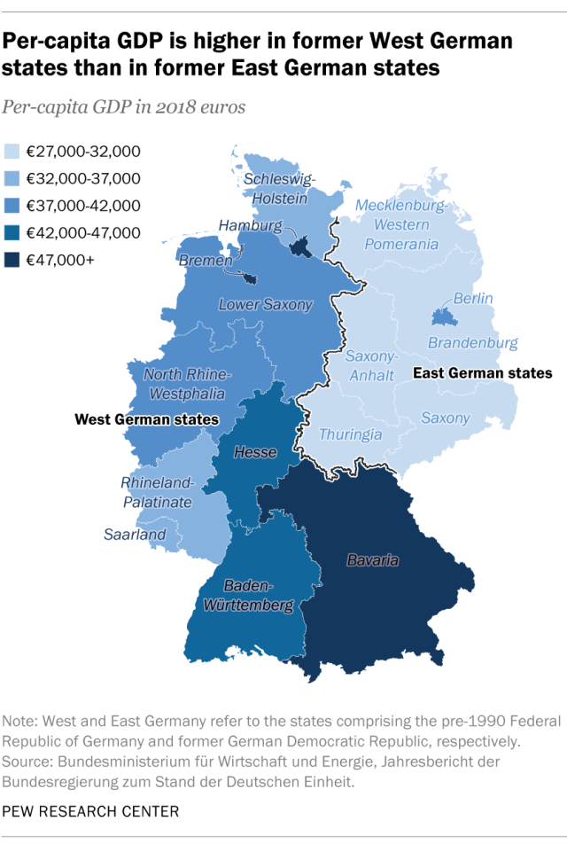
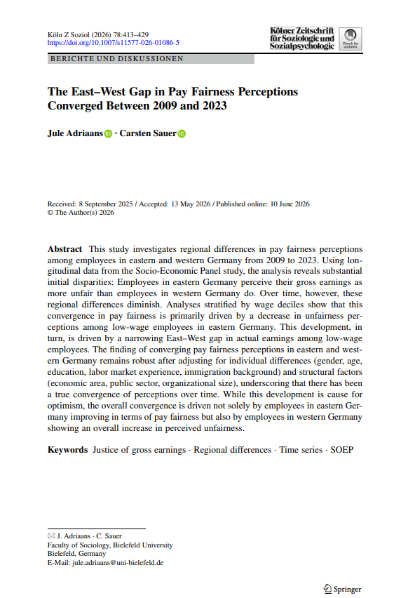
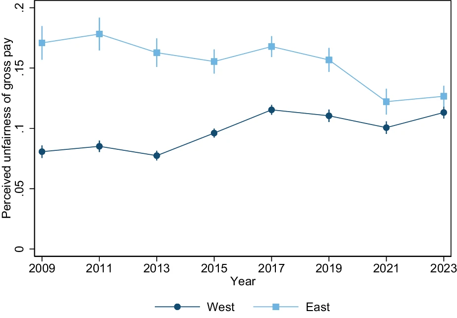
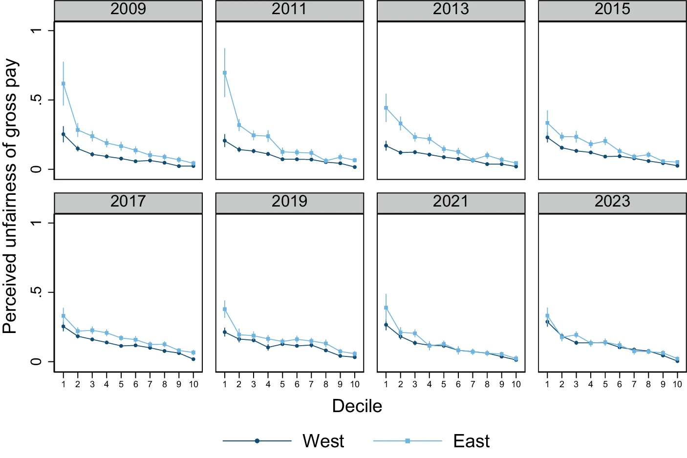
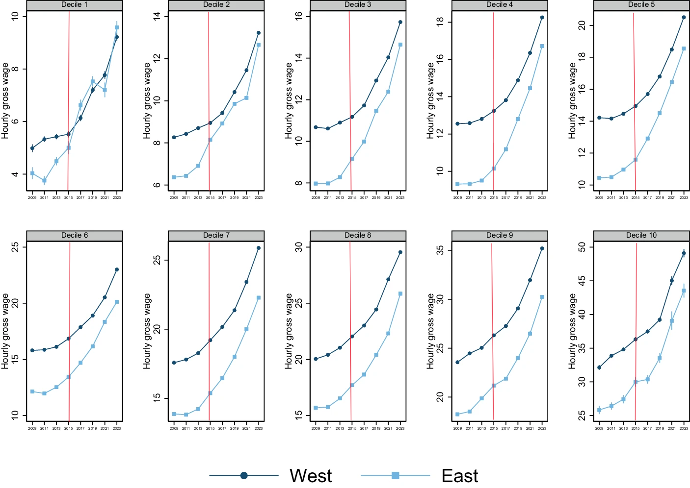
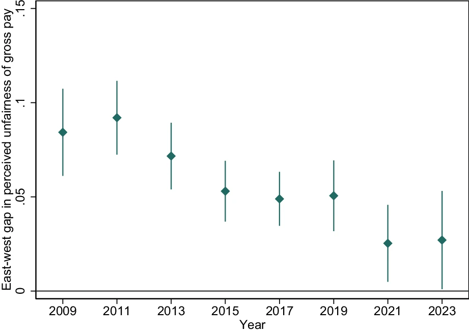

## La percepción de (in)justicia salarial: el caso alemán {.smaller}

```{r}
#| label: setup-fuentes
#| include: false

library(systemfonts)
library(sysfonts)

sysfonts::font_add(
  family  = "Gill Sans MT",
  regular = "GIL_____.TTF",
  bold    = "GILB____.TTF",
  italic  = "GILI____.TTF"
)
showtext::showtext_auto()
```

```{=html}
<style>
.reveal .slides {
  font-size: 0.85em;
}
</style>
```


::: columns
::: {.column width="58%"}
::: {.fragment fragment-index="1"}
La justicia distributiva no depende solo de **cuánto se gana**, sino de si ese monto se percibe o no como *merecido*. Quienes evalúan su pago como injusto reportan menor satisfacción con la vida, peor salud física y menor confianza política [@schunck2015; @schnaudt2021; @adriaans2023].
:::

::: {.fragment fragment-index="2"}
-  Para 2023, el salario/hora promedio en el Este era **~17% menor que en el Oeste**. Diferencias demográficas persistentes: menor densidad poblacional, mayor edad mediana, menor proporción de inmigrantes y diferencias estructurales en la composición industrial y de la fuerza laboral [@adriaans2026; @krause2019] .
:::

::: {.fragment fragment-index="3"}
En Alemania las brechas *subjetivas* Este–Oeste son antiguas y persistentes: menor satisfacción con la vida, mayor preocupación económica y menor confianza institucional en el Este [@krause2010; @braun2023; @hulle2018].
:::


:::

::: {.column width="42%"}
::: {.fragment fragment-index="2"}
{fig-align="center" width="80%"}

::: {style="font-size: 0.9em; text-align: center;"}
Fuente: @pew2019. 
:::
:::
:::
:::

------------------------------------------------------------------------

## Pregunta de investigación y objetivos {.smaller}

::: columns
::: {.column width="60%"}
::: {.fragment fragment-index="1"}
Debate actual: ¿han aumentado/bajado las diferencias entre Alemania del Este y del Oeste en términos de **actitudes, ideologías y condiciones de vida**? [@mau2024; @campbell2023]

Si las diferencias regionales en *la percepción de justicia salarial se han modificado con el tiempo*, **podría reflejar una legitimación más cohesionada de la desigualdad económica en la Alemania unificada** [@adriaans2026].
:::

::: {.fragment fragment-index="2"}
**Pregunta de investigación:** *¿cómo han cambiado, a nivel regional, las percepciones de justicia salarial entre Alemania del Este y del Oeste entre 2009 y 2023?*
:::

::: {.fragment fragment-index="3"}
- **O1:** Proporcionar nueva evidencia empírica sobre la **evolución temporal** de las brechas regionales en la percepción de justicia salarial en Alemania entre 2009 y 2023.
:::

::: {.fragment fragment-index="4"}
- **O2:** Examinar si existe una **convergencia real en estas percepciones** y descifrar qué dinámicas del mercado laboral (como los cambios en los salarios reales o políticas públicas) la han impulsado.
:::

::: {.fragment fragment-index="5"}
- **O3:** Identificar si las diferencias de percepción persisten una vez **ajustados los modelos por factores individuales** (composición de la fuerza laboral) y variables estructurales del mercado de trabajo.
:::
:::

::: {.column width="40%"}
::: {.fragment fragment-index="2"}
{fig-align="center" width="100%"}

::: {style="font-size: 0.9em; text-align: center;"}
Fuente:  @adriaans2026. 
:::
:::
:::
:::

------------------------------------------------------------------------

## Antecedentes teóricos: equidad, reciprocidad y comparación social {.smaller}

::: fragment
La sociología de la justicia pregunta **qué se percibe socialmente como justo** (empírico) [@liebig2016; @sabbagh2016]. Las percepciones de justicia son un pilar del orden social: se vinculan a **legitimidad, cooperación y confianza institucional**.
:::

::: fragment
- **Teoría de la equidad** [@adams1965]: se evalúa si la razón insumos/recompensas es *proporcional a la de otros*. Norma de reciprocidad: mayor esfuerzo, habilidades o responsabilidad $\rightarrow$ se espera mayor retribución [@adriaans2023a].
:::

::: fragment
- **Comparación social:** no evaluamos el salario en el vacío, sino frente a grupos o categorías de referencia, ocupaciones similares, personas con calificación comparable [@bygren2004; @eisnecker2024]. Estos referentes están social e institucionalmente estructurados (segmentación laboral, visibilidad, región) [@sauer2025].
:::

::: fragment
 Injusticia percibida en el pago $\rightarrow$ medición de **sentimientos de privación relativa en la población** [@jasso1978]
:::

------------------------------------------------------------------------

## Antecedentes teóricos: equidad, reciprocidad y comparación social {.smaller}

::: fragment
La injusticia surge cuando el salario real se desvía del estándar considerado justo: **subpago** vs. **sobrepago**. La **magnitud** de la desviación importa: brechas mayores $\rightarrow$ percepciones de injusticia (**"lo merecido" vs. "lo obtenido"**) más intensas y consecuencias más severas [@jasso1978; @jasso2016].
:::

::: fragment
Los principios de justicia legítimos (equidad vs. igualdad vs. necesidad) **varían según el contexto institucional y cultural** [@wegener2000; @hulle2018]:

- **Este alemán:** mayor respaldo histórico a la *igualdad de resultados*
- **Oeste alemán:** mayor peso de la *equidad* meritocrática

[@pickel2023]: la insatisfacción del Este no se explica solo por desventaja objetiva, sino también por **privación relativa** y falta de reconocimiento respecto del Oeste $\rightarrow$ potencial **deslegitimación del orden económico** $\rightarrow$ Conflictos regionales.
:::

::: fragment
Si las diferencias estructurales objetivas entre Este y Oeste se reducen con el tiempo (salarios, empleo), **se esperaría también una convergencia en las percepciones subjetivas de justicia**. Es decir, la convergencia de justicia salarial no es solo cosmética, sino un indicador de una legitimación compartida del orden económico en la Alemania unificada:

- "Changing fairness percepcionts over time therefore *reflects changes in the social and institutional environments that shape "what is fair" in labor market reward allocations*" [@adriaans2026, p. 417]

:::


------------------------------------------------------------------------

## Datos y variables {.smaller}

::: fragment
- **Datos:** *Panel Socioeconómico Alemán* (SOEP v40 2025), panel anual del DIW Berlín; justicia salarial medida cada dos años, 2009–2023.
:::

::: fragment
- **Muestra:** empleados de 18 a 65 años, $N = 75{,}583$ ($N = 66{,}600$ tras incluir covariables, listwise deletion).
:::

::: fragment
**Variable dependiente: Unfairness:** basada en el *Índice de Evaluación de Justicia* de @jasso1978

$$J = \ln\left(\frac{\text{Salario real}}{\text{Salario justo}}\right) \qquad \text{Unfairness} = -1 \times J$$

- $J = 0$: justicia perfecta
- $J < 0$ (Unfairness > 0): subpago injusto
- $J > 0$: sobrepago injusto (raro, <3%)

:::

::: fragment
**¿Cómo interpretar los valores?** Al estar en escala logarítmica, $\%\text{ subpago} = 1 - e^{-\text{Unfairness}}$

| Unfairness | % de subpago percibido |
|---|---|
| 0.08 | ~7.7% |
| 0.11 | ~10.4% |
| 0.18 | ~16.5% |

*Ejemplo:* un valor de *Unfairness* = 0.08 significa que, en promedio, las personas perciben que se les paga **~7.7% menos** de lo que consideran justo.
:::


------------------------------------------------------------------------

## Estrategia analítica {.smaller}

::: fragment
1. Descriptivos agregados + desagregados por decil salarial de ingreso (para ubicar dónde ocurre el cambio).
:::

::: fragment
2. Modelo de regresión lineal, **estimado por separado para cada año** de la encuesta, con errores estándar robustos:

$$\text{Unfairness}_i = \beta_0 + \beta_1 \text{East}_i + \gamma X_i + \delta Y_i + \varepsilon_i$$
:::

::: fragment
- $\beta_1$: brecha neta Este–Oeste en la percepción de injusticia
- $X_i$ (capital humano): género, edad y su término cuadrático, educación (CASMIN), experiencia laboral relativa y su cuadrado, trasfondo migratorio
- $Y_i$ (estructurales): tamaño de empresa (4 categorías), sector público, rama económica (13 categorías)
:::

------------------------------------------------------------------------

## Figura 1: Tendencia agregada, 2009–2023 {.smaller}

{fig-align="center" width="70%"}

::: fragment
**Fig. 1** Trends in perceived unfairness of gross pay among employees in eastern and western Germany, 2009–2023 [@adriaans2026, p. 420].

- **Oeste:** injusticia percibida sube de ~0.08 (2009) a ~0.11 (2023) — empeora gradualmente
- **Este:** se mantiene alto y estable (0.16–0.18) hasta 2017, luego cae a 0.13 en 2023
:::


------------------------------------------------------------------------

## Figura 2: La brecha por decil salarial {.smaller}

{fig-align="center" width="70%"}

::: fragment
**Fig. 2** Perceived unfairness of gross pay among employees in eastern and western Germany by wage decile from 2009 to 2023 [@adriaans2026, p. 421]. 
:::

::: fragment
- Patrón constante en todos los años: a mayor decil de ingreso, menor injusticia percibida (gradiente negativo). **Brecha Este–Oeste concentrada en deciles bajos y medios (1–6)**, especialmente marcada en 2009–2013.

- En deciles altos (7–10): diferencias mínimas y estadísticamente irrelevantes durante todo el período.
:::


<!-- Insertar aquí: Figura 2 del paper -->

------------------------------------------------------------------------

## Figura 3: Salarios nominales por decil {.smaller}


{fig-align="center" width="100%"}

::: fragment
**Fig. 3** Nominal hourly gross wages of employees in eastern and western Germany by wage decile from 2009 to 2023 [@adriaans2026, p. 422]. *Líneas rojas añadidas para año 2015 (introudcción del salario mínimo nacional).*
:::

::: fragment
Crecimiento salarial nominal generalizado en ambas regiones y todos los deciles. Factor clave: introducción del **salario mínimo nacional en 2015**, con beneficio desproporcionado para bajos ingresos del Este [@bossler2023].

- **Deciles bajos (1–5):** el Este crece más rápido que el Oeste desde ~2013. 

- **Deciles medios-altos (6–10):** la brecha salarial relativa Este–Oeste se mantiene estable, sin convergencia clara. 
:::

<!-- Insertar aquí: Figura 3 del paper -->

------------------------------------------------------------------------

## Figura 4: Estimación brecha vía OLS {.smaller}

{fig-align="center" width="70%"}

::: fragment
**Fig. 4** Adjusted East–West gap in perceived unfairness of gross pay among employees in Germany, 2009–2023 [@adriaans2026, p. 424].
:::

::: fragment
Coeficiente $\beta_1$ para cada año de la encuesta. **2009:** brecha ajustada Este–Oeste $\approx$ 9\%. incluso comparando trabajadores con las mismas características individuales y estructurales. Tendencia sostenida a la baja en los años siguientes.
:::

::: fragment
**2023:** brecha residual ≈ 2.5 p.p., **aún estadísticamente significativa** ($p = 0.042$), matiz que contrasta con la Figura 1, donde la brecha simple ya no era significativa.
:::

------------------------------------------------------------------------

## Conclusión {.smaller}

::: fragment
- **Retomando la pregunta:** hay convergencia real y estadísticamente relevante en la percepción subjetiva de justicia salarial (2009–2023) entre Alemania del Este y del Oeste, impulsada principalmente por el catch-up salarial de bajos ingresos en el Este.

- Esta es una convergencia **parcial** (persiste una brecha residual en 2023) y de **doble filo** (también empeora en el Oeste). Aporta evidencia sobre la legitimidad compartida de la desigualdad económica en la Alemania unificada, aunque no resuelve por sí sola las tensiones identitarias y políticas regionales.
:::


::: fragment
**Mecanismo principal:** el salario mínimo de 2015 actúa como catalizador del catch-up salarial en el Este; el desempleo se descarta como explicación (desacoplado de la percepción de justicia, sobre todo en el Oeste).
:::

::: fragment
**Mecanismo general:** la disolución de disparidades estructurales materiales se traduce en una alineación de actitudes subjetivas [@wegener2000].
:::

::: fragment
- La convergencia **implica mejora del Este** pero también deterioro sostenido en el Oeste (0.08 $\rightarrow$ 0.11). El país converge hacia un nivel moderado de **insatisfacción compartida** más que hacia una mejora generalizada.

- Desacople entre bienestar económico individual y cohesión política: persisten (e incluso se intensifican) tensiones identitarias Este–Oeste entre jóvenes, y el apoyo a AfD se asocia a privación *colectiva*, no personal [@mau2024; @pickel2026].
:::

------------------------------------------------------------------------

## Límites y explicaciones alternativas (I): el diseño metodológico {.smaller}

::: fragment
**Límites de los datos:**

- Salario bruto (no líquido/post-impuestos)
- Sin control por costo de vida regional (poder adquisitivo real Este vs. Oeste)
:::

::: fragment
**Modelo de regresión por año:**

- El modelo estima $\beta_1$ (brecha East–West) **para cada una de las 8 olas** (2009, 2011, ..., 2023), tratando el panel de SOEP como una secuencia de cortes transversales independientes
- Desaprovecha la estructura de panel: los **mismos individuos** son observados repetidamente, lo que permitiría distinguir cambio *intraindividual* real de cambios en la *composición* entre olas
- No se identifica una tendencia (pendiente) única y estimada formalmente, ni si el declive es realmente monótono/lineal o producto de fluctuaciones año a año
:::


------------------------------------------------------------------------

## Límites y explicaciones alternativas (II): error de medición y mecanismos complementarios {.smaller}

::: fragment
**Conexión con error de medición (Clase 2):** la distinción entre *cambio real* de creencias y *error de medición* no está completamente resuelta en este diseño. Un modelo Quasi-Simplex [@wiley1970] permitiría separar el *true score* ($\eta_t$) del error de medición ($\epsilon_t$), algo que un conjunto de regresiones año a año no logra.
:::

::: fragment
Parte de la "convergencia" observada podría reflejar **inestabilidad** en vez de un cambio genuino de creencias, especialmente relevante dado que el propio cambio de formato de la pregunta en 2015 (binario $\rightarrow$ escala de 11 puntos) introduce una fuente adicional de error de medición, solo parcialmente descartada por el chequeo de robustez de los autores [@adriaans2026, p. 418].
:::

::: fragment
**Mecanismos complementarios:**


1. *Cambio de grupo de referencia*: el Este podría comparar hoy con su entorno local en vez del Oeste
2. *Anclaje de expectativas por inflación post-pandemia*, que explicaría parte del alza en el Oeste

:::
------------------------------------------------------------------------

**¡Muchas gracias!**

Preguntas y comentarios bienvenidos.

------------------------------------------------------------------------

## Referencias {.smaller}

::: {#refs}
:::
